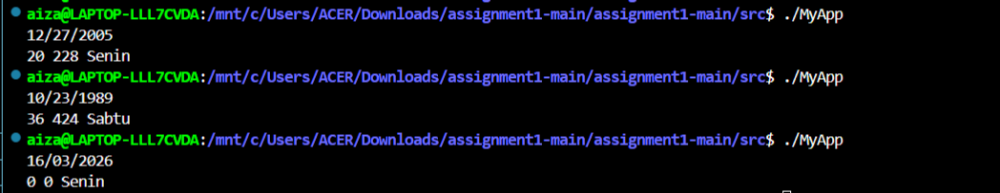

## Laporan Programming Assignment 1: Basic C++

```
cout << ageOfYear << " " << ageOfMonth << " " << dayName << endl;
```
output sesuai dengan format yg di minta 

example:


# year
#
```
int yearsOld(tm* inputTgl, tm* currentTgl)
{
    int year = (currentTgl->tm_year - inputTgl->tm_year);
    if (currentTgl->tm_mon < inputTgl->tm_mon) {
        year--;
    }
    return year;
}
    ```
year di ambil menggunakan pointer ke tm '->', baik currentTgl maupun inputTgl udah ada di tm

```
    tm* inputTgl = new tm();
    inputTgl->tm_year = yearinput - 1900;
    inputTgl->tm_mon  = monthinput - 1;
    inputTgl->tm_mday = dayinput;

    int ageOfYear = yearsOld(inputTgl, currentTgl);
    int ageOfMonth = monthsOld(inputTgl, currentTgl);
    string dayName = dayOfDate(inputTgl);
```
tm inputTgl

```
    time_t currentTime;
    time(&currentTime);
    tm* currentTgl = localtime(&currentTime);
```
tm currentTgl yg menggunkan tanggal sekarang pointer di balikan.

# month
```
int monthsOld(tm* inputTgl, tm* currentTgl)
{
    int month = (currentTgl->tm_year - inputTgl->tm_year) * 12 + (currentTgl->tm_mon - inputTgl->tm_mon);
    if (currentTgl->tm_mday < inputTgl->tm_mday) {
        month--; // belum sampai tanggal lahir bulan ini
    }
    return month;
}
```
mekanisme nya sama dengan "year"

# 
